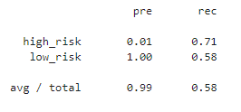
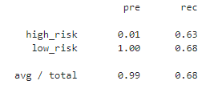
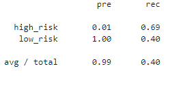
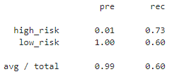
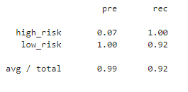
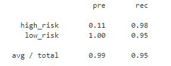

# Credit_Risk_Analysis
### Module 18 Challenge

#### Project Overview
Using skills in data preparation, statistical reasoning, and machine learning to apply machine learning to solve a real-world challenge of credit card risk. Using the
dataset from LendingClub to oversample the data using the RandomOverSampler and SMOTE algorithms, and undersample the data using the ClusterCentroids algorithm.  Then
using a combinatorial approach of over- and undersampling using the SMOTEENN algorithm. Next, comparing two new machine learning models that reduce bias,
BalancedRandomForestClassifier and EasyEnsembleClassifier, to predict credit risk. Finally evaluating the performance of these models and make a written
recommendation on whether they should be used to predict credit risk.

#### Deliverables
1. Use Resampling Models to Predict Credit Risk- using imbalanced-learn and scikit-learn libraries, RandomOverSampling, SMOTE, and ClusterCentroids algorithms
2. Use the SMOTEENN Algorithm to Predict Credit Risk
3. Use Ensemble Classifiers to Predict Credit Risk
4. A Written Report on the Credit Risk Analysis (README)

#### Results
-Naive Random Oversampling balanced accurracy score 0.646
 
 
-SMOTE Oversampling balanced accuracy score 0.659
 
 
-Undersampling balanced accuracy score 0.658
 
 
-Combination Sampling balanced accuracy score 0.544
 
 
-Balanced Random Forest balanced accuracy score is 0.960
 
 
-Easy Ensemble AdaBoost balanced accuracy score 0.965
 
 
#### Summary
The Easy Ensemble AdaBoost was the most accurate model for predicting credit risk. Combination Sampling was the least accurate model for predicting credit risk.
